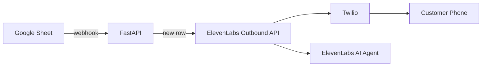

# Lumi Outbound AI Caller

End-to-end workflow: **Google Sheets** (leads) → **Apps Script webhook** → **FastAPI** → **ElevenLabs Conversational AI** (outbound call via **Twilio**).

The AI conversation runs entirely on your **existing ElevenLabs agent** — no custom OpenAI realtime streaming.

---

## Architecture (5 steps)

| Step | Component | What happens |
|------|-----------|--------------|
| 1 | Google Sheet | You add a row: `name`, `address`, `phone_no` |
| 2 | Apps Script webhook | POSTs new row instantly to FastAPI |
| 3 | Dedup (SQLite) | Skips rows already called (`data/processed_leads.db`) |
| 4 | ElevenLabs API | `POST /v1/convai/twilio/outbound-call` starts Twilio outbound call |
| 5 | ElevenLabs agent | Handles voice; receives `first_name`, `address`, `phone_no` as dynamic variables |



---

## Project structure

```
app/
  main.py                 # FastAPI app + lifespan
  config/settings.py      # Environment variables
  models/lead.py          # Lead dataclass
  integrations/
    google_sheets.py      # Sheets API read
    elevenlabs.py         # Outbound call API
    twilio_webhooks.py    # Optional status logging
  services/
    lead_processor.py     # Webhook lead → call
    call_orchestrator.py  # Lead → ElevenLabs call
  routes/
    health.py             # /health, /status
    webhooks.py           # /webhooks/twilio/* (optional)
    sheets_webhooks.py    # POST /webhooks/sheets/new-lead
    calls.py              # Manual trigger-row endpoint
  utils/
    dedup_store.py        # SQLite deduplication
    retry.py              # Exponential backoff
data/                     # SQLite DB when DATABASE_BACKEND=sqlite (gitignored)
supabase/schema.sql       # Run in Supabase SQL Editor (tables only)
credentials/              # Google service account JSON (gitignored)
```

---

## Prerequisites

- Python 3.11+
- [Twilio](https://www.twilio.com) account with a **purchased voice number**
- [ElevenLabs](https://elevenlabs.io) account with a **Conversational AI agent** already created
- [Google Cloud](https://console.cloud.google.com) project + Sheets API + service account
- [ngrok](https://ngrok.com) (optional for webhooks; **not required** for basic outbound calls via ElevenLabs API)

---

## 1. Twilio setup

1. Sign in to [Twilio Console](https://console.twilio.com).
2. Note your **Account SID** and **Auth Token** (Dashboard home).
3. Buy or use an existing **phone number** with Voice capability.
4. Copy the number in **E.164** format (e.g. `+14155551234`) → `TWILIO_PHONE_NUMBER` in `.env`.
5. **Trial accounts**: verify `+919752713547` (or your test number) under Phone Numbers → Verified Caller IDs.

> Outbound calls are initiated by **ElevenLabs** using the Twilio number you link in their dashboard (next section). You do not configure TwiML on your server for the main flow.

### Post-call SMS (required: ElevenLabs webhook)

**ElevenLabs outbound calls do not send Twilio Status Callbacks to your server** — Twilio only notifies ElevenLabs. SMS is sent automatically to all customers after call completion.

1. Start ngrok: `ngrok http 8000`
2. Set `PUBLIC_BASE_URL=https://YOUR-SUBDOMAIN.ngrok-free.app` in `.env`
3. **ElevenLabs → Settings → Webhooks → Create**
   - URL: `{PUBLIC_BASE_URL}/webhooks/elevenlabs/post-call`
   - Event: **post_call_transcription** (or **post_call_audio** for faster delivery)
   - Copy the webhook **secret** → `ELEVENLABS_WEBHOOK_SECRET` in `.env`
4. **Assign that webhook** to your agent (agent → Webhooks / overrides)
5. Restart uvicorn. After a call ends you should see:
   - `ElevenLabs call ended event=post_call_transcription conversation_id=conv_...`
   - `SMS sent successfully ... message_sid=SM...`

Optional Twilio status URL (`/webhooks/twilio/status`) only helps if you place calls via Twilio REST yourself, not via ElevenLabs API.

### Discord call summaries (same channel every call)

After each ElevenLabs post-call webhook, the app posts an embed to your Discord channel.

1. Discord → your server → channel → **Edit Channel** → **Integrations** → **Webhooks** → **New Webhook**
2. Name it (e.g. `Lumi Calls`), pick the channel, **Copy Webhook URL**
3. Add to `.env`:
   ```env
   DISCORD_WEBHOOK_URL=https://discord.com/api/webhooks/...
   DISCORD_NOTIFICATIONS_ENABLED=true
   ```
4. Restart uvicorn. After a call ends, check the channel and logs for `Discord call summary posted`.

Requires `post_call_transcription` on your ElevenLabs webhook (for transcript summary).

---

## 2. ElevenLabs setup

1. Open [ElevenLabs Conversational AI](https://elevenlabs.io/app/conversational-ai).
2. Open your **existing agent**.
3. Copy **Agent ID** → `ELEVENLABS_AGENT_ID`.
4. Go to **Phone Numbers** → **Import** or connect your **Twilio** number:
   - Link the same Twilio account and select your purchased number.
   - Copy **Phone Number ID** → `ELEVENLABS_AGENT_PHONE_NUMBER_ID`.
5. In the agent prompt, use dynamic variables (must match API keys):
- `{{first_name}}` — customer name from sheet
- `{{address}}` — customer address from sheet
- `{{phone_no}}` — customer phone from sheet (E.164, e.g. `+919752713547`)
6. Create an [API key](https://elevenlabs.io/app/settings/api-keys) → `ELEVENLABS_API_KEY`.

### API call (what the backend does)

```http
POST https://api.elevenlabs.io/v1/convai/twilio/outbound-call
xi-api-key: YOUR_KEY

{
  "agent_id": "...",
  "agent_phone_number_id": "...",
  "to_number": "+919752713547",
  "conversation_initiation_client_data": {
    "dynamic_variables": {
      "first_name": "John Doe",
      "address": "123 Main St",
      "phone_no": "+919752713547"
    }
  }
}
```

---

## 3. Google Sheets setup

### Sheet format

Row 1 must include these headers (other columns are fine — e.g. Timestamp, Email, Zip):

| First Name | Last Name | Street Address | Phone | … |
|------------|-----------|----------------|-------|---|
| John | Doe | 123 Main St | 919752713547 | … |

Extra form fields (Email, Zip, Property Type, etc.) are ignored for calling. `phone_no` is ignored when `TEST_MODE=true`; calls always go to `TEST_CALL_NUMBER`.

### Google Cloud

1. [Google Cloud Console](https://console.cloud.google.com) → create/select project.
2. **APIs & Services** → **Library** → enable **Google Sheets API**.
3. **APIs & Services** → **Credentials** → **Create credentials** → **Service account**.
4. Create key → **JSON** → download to `credentials/google-service-account.json`.
5. Open your Google Sheet → **Share** → add the service account email (e.g. `xxx@xxx.iam.gserviceaccount.com`) as **Viewer** (or Editor).
6. Copy spreadsheet ID from URL:
   `https://docs.google.com/spreadsheets/d/<SPREADSHEET_ID>/edit`
   → `GOOGLE_SHEETS_SPREADSHEET_ID`.

### Apps Script webhook (instant calls)

When a row is added, Google Sheets cannot call your server directly — a small script in the sheet POSTs to FastAPI.

1. Set a strong secret in `.env`:
   ```env
   SHEETS_WEBHOOK_SECRET=your-long-random-secret
   ```
2. Ensure `PUBLIC_BASE_URL` is your ngrok or production URL (must be HTTPS).
3. Open the spreadsheet → **Extensions** → **Apps Script**.
4. Paste `scripts/sheets_webhook.gs` and set:
   - `WEBHOOK_URL` → `{PUBLIC_BASE_URL}/webhooks/sheets/new-lead`
   - `WEBHOOK_SECRET` → same as `SHEETS_WEBHOOK_SECRET`
   - `SHEET_NAME` → same as `GOOGLE_SHEETS_WORKSHEET_NAME`
5. If the sheet **already has lead rows**, run **`initializeLastProcessedRow`** once first (skips existing rows).
6. Run **`setupSheetsWebhookTrigger`** once (authorize when prompted).
7. Add a test row — the call should start within a few seconds.

To re-process rows after clearing dedup, reset the script cursor: Apps Script → **Project Settings** → **Script properties** → delete `lastProcessedRow`, or run `processNewRows` manually.

---

## 4. Environment variables

Copy the template and fill in values:

```powershell
copy .env.example .env
```

| Variable | Where to get it |
|----------|-----------------|
| `TWILIO_ACCOUNT_SID` | Twilio Console → Dashboard |
| `TWILIO_AUTH_TOKEN` | Twilio Console → Dashboard |
| `TWILIO_PHONE_NUMBER` | Twilio → Phone Numbers (E.164) |
| `ELEVENLABS_API_KEY` | ElevenLabs → Settings → API Keys |
| `ELEVENLABS_AGENT_ID` | ElevenLabs → your agent |
| `ELEVENLABS_AGENT_PHONE_NUMBER_ID` | ElevenLabs → agent → Phone Numbers |
| `GOOGLE_SHEETS_SPREADSHEET_ID` | Sheet URL |
| `GOOGLE_SERVICE_ACCOUNT_JSON` | Path to JSON file |
| `SHEETS_WEBHOOK_SECRET` | Random secret (match Apps Script `WEBHOOK_SECRET`) |
| `PUBLIC_BASE_URL` | ngrok/production URL for Sheets + ElevenLabs webhooks |

### Supabase (cloud Postgres, tables only)

1. [Supabase](https://supabase.com) → New project → wait for database ready.
2. **SQL Editor** → New query → paste contents of `supabase/schema.sql` → **Run**.
3. **Project Settings** → **API**:
   - **Project URL** → `SUPABASE_URL`
   - **service_role** key (secret) → `SUPABASE_SERVICE_ROLE_KEY` — backend only, never in frontend.
4. In `.env`:
   ```env
   DATABASE_BACKEND=supabase
   SUPABASE_URL=https://YOUR_PROJECT.supabase.co
   SUPABASE_SERVICE_ROLE_KEY=eyJ...
   ```
5. Restart uvicorn. `GET /status` should show `"database_backend": "supabase"`.

Leave `DATABASE_BACKEND=sqlite` (default) to keep using `data/processed_leads.db` locally. No data is migrated automatically.

---

## 5. Run locally

### Install

```powershell
cd c:\Users\abhi1\Desktop\lumi_energy11
python -m venv .venv
.\.venv\Scripts\Activate.ps1
pip install -r requirements.txt
```

### Start API

```powershell
uvicorn app.main:app --reload --host 0.0.0.0 --port 8000
```

- Health: http://localhost:8000/health  
- Status (processed leads): http://localhost:8000/status  
- API docs: http://localhost:8000/docs  

Leads arrive via the Google Apps Script webhook (`POST /webhooks/sheets/new-lead`). `GET /status` shows whether `SHEETS_WEBHOOK_SECRET` is configured.

### Expose with ngrok (required for Sheets webhook)

The Apps Script must reach your server over HTTPS:

```powershell
ngrok http 8000
```

Copy the HTTPS URL (e.g. `https://abc123.ngrok-free.app`) into `.env`:

```
PUBLIC_BASE_URL=https://abc123.ngrok-free.app
```

Restart uvicorn after updating `.env`.

---

## 6. End-to-end test

1. Ensure `.env` is complete, `PUBLIC_BASE_URL` is set, and Apps Script webhook is installed.
2. Add one row to the sheet (name + address; phone can be dummy).
3. The call should start within a few seconds. Or trigger manually (reads sheet via service account):

```powershell
# Call a specific row (row 2 = first data row)
curl -X POST http://localhost:8000/calls/trigger-row -H "Content-Type: application/json" -d "{\"row_number\": 2}"

# Or POST the same payload as Apps Script
curl -X POST http://localhost:8000/webhooks/sheets/new-lead `
  -H "Content-Type: application/json" `
  -H "X-Sheets-Webhook-Secret: YOUR_SECRET" `
  -d "{\"row_number\": 2, \"first_name\": \"john\", \"last_name\": \"cina\", \"address\": \"123 main\", \"phone_no\": \"919752713547\"}"
```

4. Your phone (`+919752713547`) should ring; the ElevenLabs agent should know `first_name`, `address`, and `phone_no`.
5. Check logs in the terminal and `GET http://localhost:8000/status` for `call_sid` / `conversation_id`.

### Retry the same row

Delete the row from SQLite or remove `data/processed_leads.db`, then trigger again.

---

## Deduplication

Each sheet row gets a stable `row_key` (row number + content hash). After a successful or failed call attempt, the row is stored in the dedup store so it is not called again.

---

## Troubleshooting

| Issue | Fix |
|-------|-----|
| Google 403 / permission denied | Share sheet with service account email |
| ElevenLabs 422 | Check `agent_id`, `agent_phone_number_id`, E.164 `to_number` |
| Twilio trial won't call | Verify destination number in Twilio Console |
| No new calls on new row | Check Apps Script **Executions** log; verify ngrok URL + `SHEETS_WEBHOOK_SECRET`; row may already be in dedup DB |
| Agent missing variables | Add `{{first_name}}`, `{{address}}`, `{{phone_no}}` in ElevenLabs agent config |

---

## Production notes (later)

- Set `TEST_MODE=false` to use `phone_no` from the sheet.
- Rotate `SHEETS_WEBHOOK_SECRET` periodically; update Apps Script to match.
- Run behind a process manager (systemd, Docker, cloud Run).
- Rotate API keys; never commit `.env` or `credentials/*.json`.

---

## License

Private / internal use.
